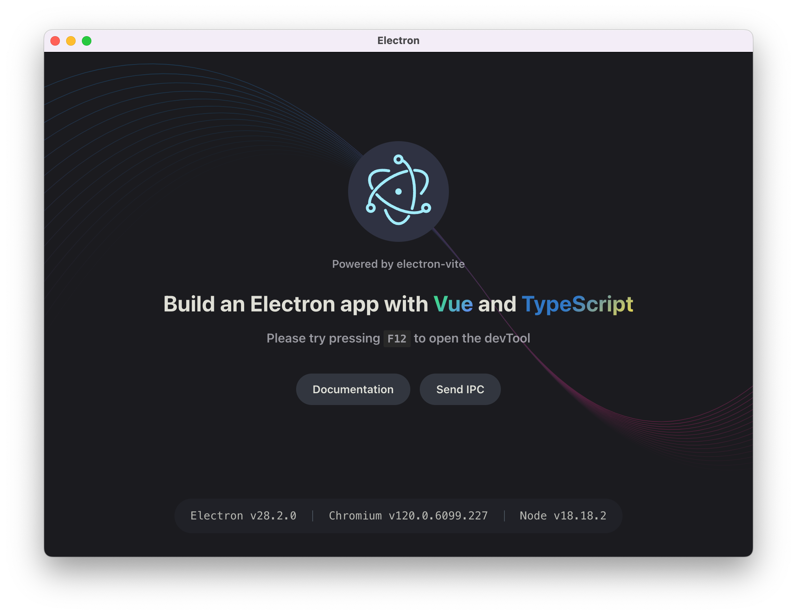

<h1 align="center">electron-app</h1>

<p align="center">An Electron application with Vue3 and TypeScript</p>

<p align="center">


</p>

<p align='center'>

</p>

## Features

- 💡 Optimize asset handling
- 🚀 Fast HMR for renderer processes
- 🔥 Hot reloading for main process and preload scripts
- 🔌 Easy to debug
- 🔒 Compile to v8 bytecode to protect source code

## Getting Started

Read [documentation](https://electron-vite.org/) for more details.

- [Configuring](https://electron-vite.org/config/)
- [Development](https://electron-vite.org/guide/dev.html)
- [Asset Handling](https://electron-vite.org/guide/assets.html)
- [HMR](https://electron-vite.org/guide/hmr.html) & [Hot Reloading](https://electron-vite.org/guide/hot-reloading.html)
- [Debugging](https://electron-vite.org/guide/debugging.html)
- [Source code protection](https://electron-vite.org/guide/source-code-protection.html)
- [Distribution](https://electron-vite.org/guide/distribution.html)
- [Troubleshooting](https://electron-vite.org/guide/troubleshooting.html)

You can also use the [create-electron](https://github.com/alex8088/quick-start/tree/master/packages/create-electron) tool to scaffold your project for other frameworks (e.g. `React`, `Svelte` or `Solid`).

## Recommended IDE Setup

- [VSCode](https://code.visualstudio.com/) + [ESLint](https://marketplace.visualstudio.com/items?itemName=dbaeumer.vscode-eslint) + [Prettier](https://marketplace.visualstudio.com/items?itemName=esbenp.prettier-vscode) + [Volar](https://marketplace.visualstudio.com/items?itemName=Vue.volar) + [TypeScript Vue Plugin (Volar)](https://marketplace.visualstudio.com/items?itemName=Vue.vscode-typescript-vue-plugin)

## Project Setup

### Install

```bash
$ npm install
```

### Development

```bash
$ npm run dev
```

### Build

```bash
# For windows
$ npm run build:win

# For macOS
$ npm run build:mac

# For Linux
$ npm run build:linux
```

## Examples

- [electron-vite-bytecode-example](https://github.com/alex8088/electron-vite-bytecode-example), source code protection
- [electron-vite-decorator-example](https://github.com/alex8088/electron-vite-decorator-example), typescipt decorator
- [electron-vite-worker-example](https://github.com/alex8088/electron-vite-worker-example), worker and fork
